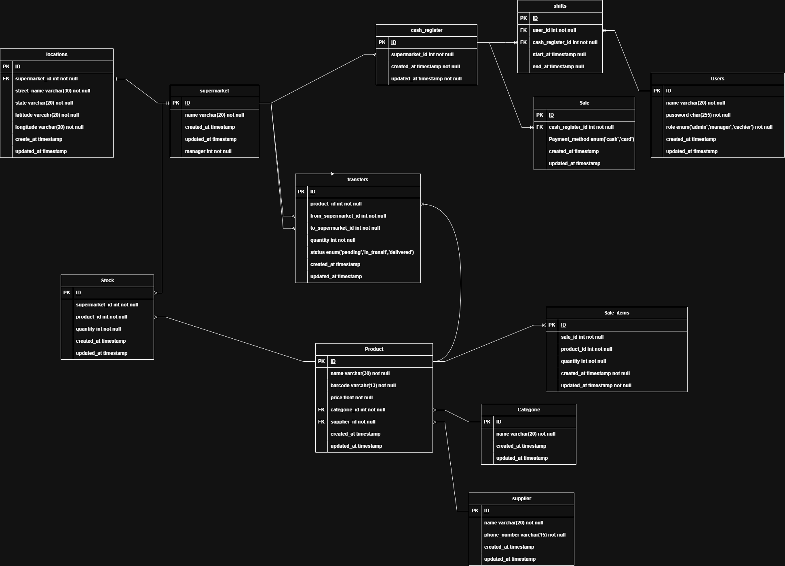

# Hypermarket Sales Management System

## Entity Relationship Diagram (ERD)

This ERD outlines the architecture of our Hypermarket Sales Management System. It is designed to support operations across multiple supermarket locations, with a focus on sales tracking, inventory management, and shift-based employee roles.

### Entities and Their Roles:

#### 🏬 Supermarkets and Locations
- **supermarket**: Stores details about each supermarket, including name and manager.
- **locations**: Linked to supermarkets to track physical addresses with GPS coordinates.

#### 👨‍💼 Users and Roles
- **Users**: Stores employee information. Roles include `admin`, `manager`, and `cashier`.
- **shifts**: Tracks which users work at which cash registers and when.

#### 💰 Cash Registers and Sales
- **cash_register**: Each supermarket has one or more registers.
- **Sale**: Represents a sale, linked to a cash register and includes payment method (`cash`, `card`).
- **Sale_items**: Items sold in each sale, with quantities and product references.

#### 📦 Inventory Management
- **Product**: Stores products with barcodes, names, prices, categories, and suppliers.
- **Categories**: Classifies products (e.g., beverages, groceries).
- **supplier**: Holds supplier contact info.
- **Stock**: Keeps track of current stock of products in each supermarket.

#### 🔁 Product Transfers
- **transfers**: Logs product transfers between supermarkets. Includes:
  - `from_supermarket_id`, `to_supermarket_id`
  - `status` values: `pending`, `in_transit`, `delivered`

## System Highlights
- 📍 Geolocation support for each supermarket
- 🔄 Product transfer between branches with tracking
- 🧾 Detailed sales tracking per cashier and register
- 📊 Role-based user management with shift tracking

